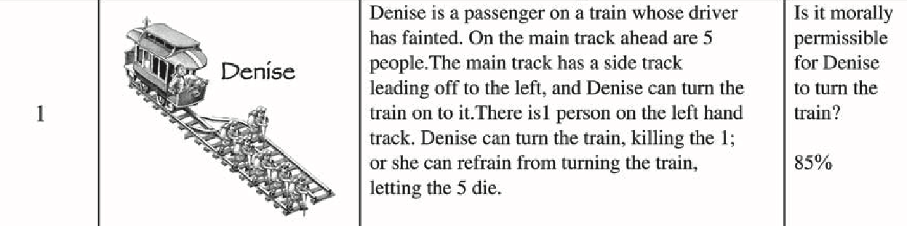
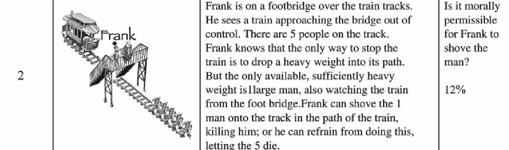
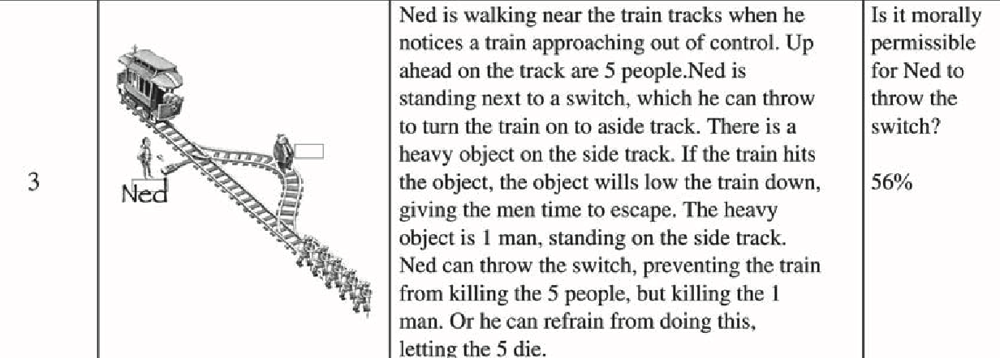
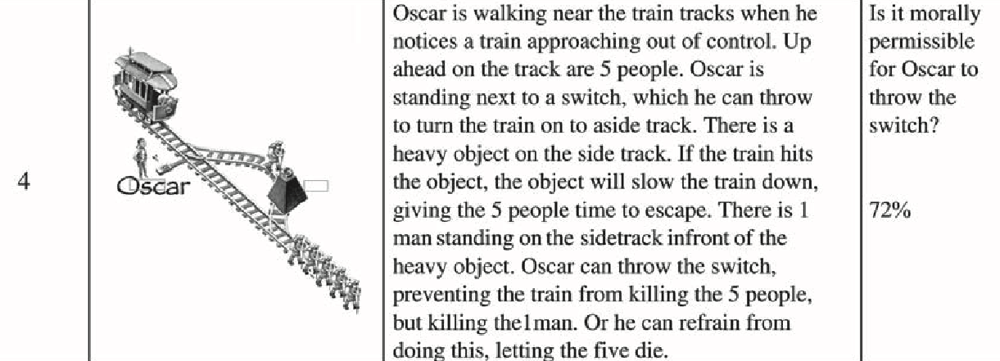

# Two-Sided Fisher's Exact Test

- By Order: Study questions sequences (we dont care)
- By Site: Different institutes ('uva' or 'uiuc')
- Global: Aggregate all data together, YOLO!
- Some are one-sided test? NOT SURE

## [1. Framing decisions (Tversky & Kahneman, 1981) Problem 10](../OSFdata/Framing%20(Tversky%20&%20Kahneman,%201981)/)

Not two-sided, Greater

**$H_0$:** Price of the item does **not** affect travel choice.

**$H_1$:** People travel **more** for the cheaper item.

|           | $30 Item (Vase) | $250 Item (Hanging) | Total |
|-----------|-----------------|---------------------|-------|
| **Yes**   | ya              | yb                  | y1    |
| **No**    | na - ya         | nb - yb             |       |
| **Total** | na              | nb                  | n     |

**Original Stats:** Z = 5.14, p = 7.4e-7, OR = 4.96

---

## [5. Affect and Risk (Rottenstreich & Hsee, 2001) Study 1](../OSFdata/Affect%20&%20Risk%20(Rottenstreich%20&%20Hsee,%202001))

**$H_0$:** Choice is **independent** of probability level.

**$H_1$:** "Kiss" is preferred **more** at 1% than at 100%.

|           | 1% Chance | 100% Certain | Total |
|-----------|-----------|--------------|-------|
| **Kiss**  | ya        | yb           | y1    |
| **$50**   | na - ya   | nb - yb      |       |
| **Total** | na        | nb           | n     |

**Original Stats:** $\chi^2$(1, N=40) = 4.91, p = 0.0267, φ = 0.35

---

## [11. Trolley Dilemma 1 (Hauser et. al. 2007) Scenarios 1+2](../OSFdata/Trolley%20Dilemma%201%20(Hauser%20et%20al.,%202007))

the sites (different studies) are column `Source.Secondary`

**$H_0$:** Acting is the **same** for Denise vs Frank

**$H_1$:** Acting is **favored** for Denise over Frank.

|           | Denise  | Frank   | Total |
|-----------|---------|---------|-------|
| **Yes**   | ya      | yb      | y1    |
| **No**    | na - ya | nb - yb |       |
| **Total** | na      | nb      | n     |

**Original Stats:** χ2(1, N = 2646) = 1615.96, p < 0.001

---

## [17. Trolley Dilemma 2 (Hauser et. al. 2007) Scenarios 3+4](../OSFdata/Trolley%20Dilemma%202%20(Hauser%20et%20al.,%202007))

Not two-sided, Greater

**$H_0$:** Acting is the **same** for Oscar vs Ned.

**$H_1$:** Acting is **favored** for Oscar over Ned.

|           | Oscar   | Ned     | Total |
|-----------|---------|---------|-------|
| **Yes**   | ya      | yb      | y1    |
| **No**    | na - ya | nb - yb |       |
| **Total** | na      | nb      | n     |

**Original Stats:** χ2(1, N = 2612) = 72.35, p < 0.001

